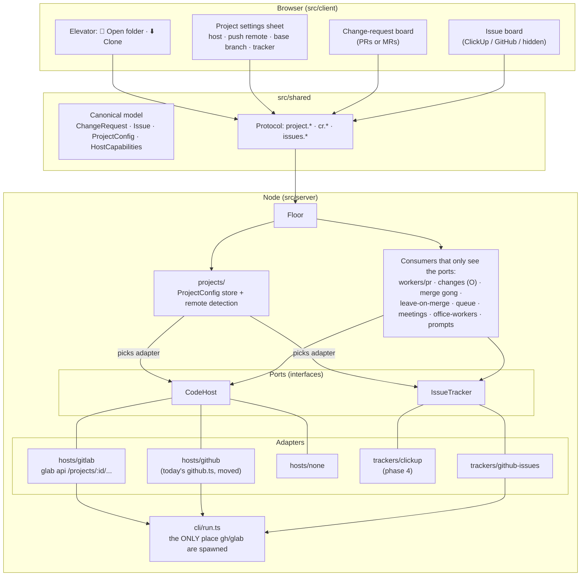
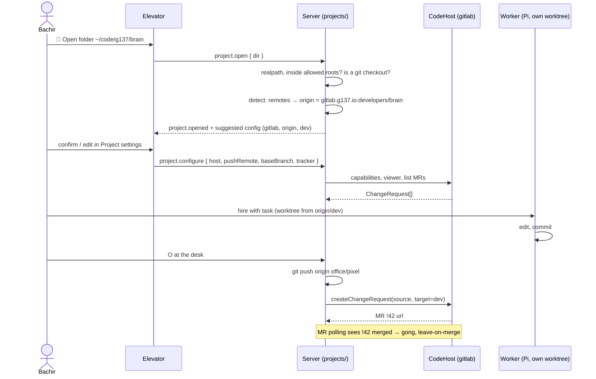
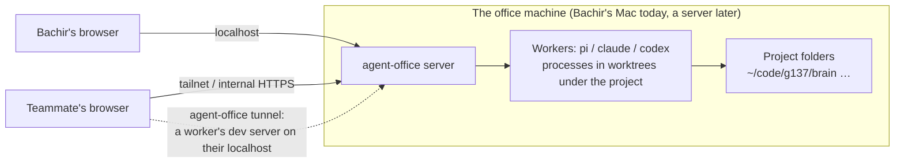

# Fork plan: local projects, any code host, any issue tracker

Fork: `basheer421/agent-office`. Upstream: `AgentSystemLabs/agent-office` (merged in weekly, PRs offered back when they're generic).

## Why

The office assumes **one thing everywhere: a floor is a GitHub repo**. `gh` is spawned from 9 files, `Gh*` types reach 40 files on both sides, and issues, PRs, cloning, sign-ins and the agents' prompts all speak GitHub.

What we want instead:

| Today | After |
|---|---|
| A floor is a GitHub `owner/repo`, cloned by `gh` | A floor is **a folder on this machine**. Cloning is just one way to get one |
| Code host is always GitHub | Each project picks a **code host**: GitLab, GitHub, or none (local only) |
| Issues come from GitHub | Issues come from an **issue tracker** picked per project: ClickUp, GitHub Issues, or none. Separate from the code host |
| Push always goes to `origin`, worktrees fork from `origin/<current branch>` | Each project says its **push remote** and **base branch** (Brain: `origin` / `dev`) |
| Prompts tell agents to run `gh …` | Prompts are written against the project's host (`glab mr create` on GitLab) |

## Target architecture



### A floor's life



## Design rules (our habits, enforced)

| Rule | How it's enforced |
|---|---|
| **One place spawns host CLIs.** `gh` / `glab` only from `src/server/cli/run.ts`, called only by adapters | Architecture test greps `src/` for `execFile('gh'`, `spawn('glab'`, etc. outside `cli/` and fails |
| **Consumers depend on ports, never adapters.** Only `hosts/index.ts` / `trackers/index.ts` (the factories) import an adapter | Architecture test on imports |
| **No `if (host === 'gitlab')` outside adapters.** Differences are capabilities (`canAutoMerge`, `labels`, `reviews`, `draft`) and vocabulary (`"merge request"`, `"!42"` vs `"#42"`) the adapter declares | Code review; exhaustive `switch` only in factories |
| **One canonical model.** `ChangeRequest`, `Issue`, `Label`, `Check`, `Comment` in `src/shared/model/`. Adapters map host JSON into it; nothing else sees host JSON | `Gh*` types deleted at the end of phase 1 |
| **One config source per project.** `ProjectConfig` read/written only by `projects/store.ts` (in `<project>/.agent-office/project.json`, so it travels with the checkout) | Same value defined twice = bug |
| **Errors are typed, not strings.** `HostError { kind: 'auth' \| 'not-found' \| 'no-remote' \| 'cli-missing' \| 'rate-limit' \| 'unknown', hint }`, and the UI shows the hint | Adapters' contract tests check the mapping |
| **Paths opened from the browser are checked.** `realpath`, inside the allowed roots (default `~/code`), admins only | Integration test with `..` and symlinks |
| **Upstream's rules still hold**: features as modules via the registries, `tests/size.test.ts` green, modals with ✕ + Esc | Their tests |
| **Tests are integration level.** Contract suite runs **every adapter against a fake `gh` / `glab` binary** on `PATH` that replays recorded JSON. Plus a live smoke script against a scratch project on gitlab.g137.io | `npm test` + `scripts/e2e-gitlab.sh` |

## The ports

```ts
// src/server/hosts/types.ts
interface CodeHost {
  readonly kind: 'github' | 'gitlab' | 'none';
  readonly caps: HostCapabilities;          // labels, reviews, autoMerge, draft, mergeMethods…
  readonly words: HostVocabulary;           // "merge request", "!", cli: "glab", prompt snippets

  viewer(): Promise<string>;
  list(): Promise<ChangeRequest[]>;         // open + recently merged/closed
  detail(n: number): Promise<ChangeRequestDetail>;
  diff(n: number): Promise<string>;
  create(o: { source: string; target: string; title: string; body: string }, as?: Actor): Promise<ChangeRequest>;
  findForBranch(branch: string): Promise<ChangeRequest | undefined>;
  comment(n: number, body: string, as?: Actor): Promise<Comment>;
  review(n: number, body: string, as?: Actor): Promise<string>;
  merge(n: number, o: MergeOptions, as?: Actor): Promise<void>;
  close(n: number, o: CloseOptions, as?: Actor): Promise<void>;
  labels?: LabelOps;                        // present only when caps.labels
  /** Recognises "I opened one myself" in a worker's shell (gh pr create / glab mr create). */
  createdBy(command: string, output: string): string | undefined;
}

// src/server/trackers/types.ts
interface IssueTracker {
  readonly kind: 'clickup' | 'github' | 'none';
  readonly caps: TrackerCapabilities;       // comment, close, assign, labels — ClickUp starts read-only
  list(): Promise<Issue[]>;
  detail(id: string): Promise<IssueDetail>;
  /** The line a worker's prompt and the CR body use: "ClickUp task 86c1x2" / "Closes #12". */
  reference(issue: Issue): IssueReference;
}
```

`Issue.id` is a **string** (ClickUp ids aren't numbers). Today's code keys issues by `number`; that changes in phase 1.

## Phases

| # | Phase | What lands | Done when |
|---|---|---|---|
| 0 | **Fork house rules** | `AGENTS.md`: our merge rule, identity, upstream sync. This plan | Merged on the fork |
| 1 | **Ports + GitHub adapter (no behaviour change)** | `cli/run.ts`, `src/shared/model/`, `CodeHost` + `IssueTracker` ports, today's `github.ts` split into `hosts/github` + `trackers/github-issues`, every consumer moved to the ports, protocol `gh.*` → `cr.*` / `issues.*`, `ui/github/` → `ui/boards/`, architecture tests | All upstream tests green, plus a GitHub floor (this fork itself) still shows boards, opens a PR with **O**, rings the gong |
| 2 | **Local projects** | `projects/`: `ProjectConfig` store, remote detection, allowed roots. Elevator **📂 Open folder** (server-side folder picker, admins). Project settings sheet. Worktrees fetch `pushRemote/baseBranch`; **O** pushes to `pushRemote` and targets `baseBranch`. Clone tab stays (GitHub) | Brain opened from `~/code/g137/brain`, worktree starts from `origin/dev`, host shows *none* until phase 3 |
| 3 | **GitLab adapter** | `hosts/gitlab` on `glab api` (REST v4, project by URL-encoded path, MR `iid`). MR board, detail, diff, comments, merge (incl. *merge when pipeline succeeds*), close, labels, pipeline status as checks. `glab mr create` detection. GitLab prompt vocabulary. Clone tab lists GitLab projects. ⚙️ default host + GitLab hostname (`gitlab.g137.io`) | On Brain: hire → **O** opens MR against `dev` → merge it on GitLab → gong + leave-on-merge. Fake-`glab` contract tests green. `scripts/e2e-gitlab.sh` green on a scratch project |
| 4 | **ClickUp tracker** (only after 3 is confirmed working) | `trackers/clickup`: one list (or view) per project, read-only to start. Issue board shows ClickUp tasks; **Hand to a worker** / **Add to queue** put the task id + link in the prompt and the MR body. No auto-claim, no status changes (draft-only rule) | Brain's ClickUp list on the board, a task handed to a worker ends as an MR that mentions it |
| 5 | **Per-person GitLab sign-in** | `glab` config dir per account (like today's `GH_CONFIG_DIR`), token paste flow | Only if someone besides Bachir uses the office |

Each phase is one PR on the fork (phase 1 may be 2–3 stacked PRs: ports+model, consumers, protocol/UI rename).

## What it costs (honest)

| Choice | Cost | Why we take it anyway |
|---|---|---|
| Renaming the protocol and `ui/github/` to neutral names | Every upstream change to the GitHub UI will conflict in the weekly merge | Leaving `gh.*` names over a GitLab board is the kind of lie that rots. Conflicts are mechanical once the rename is one commit |
| Issues keyed by string | Touches queue, carrying, boards, prompts | ClickUp needs it; doing it later is worse |
| Contract tests against fake CLIs | Fixtures to record and keep current | It's the only way to test both adapters without hitting real hosts on every `npm test` |
| Upstream PRs | They may say no, especially to phase 1 (it moves their code) | Fine. Phases 2 and 3 are the likeliest to be wanted |

## Zero-config by default

The project config is **detected, not filled in**. Opening a folder asks nothing; the settings sheet exists only to override a wrong guess.

| Field | Detected from | Brain gets |
|---|---|---|
| Push remote | `origin`, else the only remote | `origin` |
| Code host | the push remote's URL: `github.com` → GitHub, the ⚙️ GitLab hostname (`gitlab.g137.io`) → GitLab, else none | GitLab |
| Project path | the same URL | `developers/brain` |
| Base branch | `refs/remotes/<remote>/HEAD` (the host's default branch) | `dev` |
| Issue tracker | nothing to detect: none until **Connect ClickUp** | none |

`project.json` stores **only the fields someone overrode**; everything else is re-detected on open, so a changed remote is picked up by itself.

## Decisions

| # | Decision |
|---|---|
| 1 | Overrides live in `<project>/.agent-office/project.json` (travels with the checkout) |
| 2 | **📂 Open folder**: admins only, inside allowed roots (default `~/code`, editable in ⚙️). Paths are on the **office's machine**, not the viewer's |
| 3 | Floor with tracker *none*: issue board stays, empty, with **Connect ClickUp** |
| 4 | Upstream sync only when Bachir asks |

## Multiplayer, and where workers run

The office is **one server process on one machine**. Everyone else is a browser.



| Question | Answer |
|---|---|
| Where do workers run? | On the office machine, as its OS user, in that machine's folders. A teammate hiring a worker runs code **on your Mac** if the office is on your Mac |
| What does a teammate see? | The same 3D office, live terminals, boards, voice, screen share. They type into the same terminals |
| Whose credentials? | With accounts (`agent-office accounts invite`), each person's own Claude/GitHub sign-in, so commits are under their name. Phase 5 adds GitLab. Without accounts, everyone runs on the machine's own logins |
| Is it isolated per person? | **No.** Every worker is the same OS user: anyone signed in can run any command as that user and read any project folder. Invite only people you'd give SSH to |
| **📂 Open folder** in multiplayer | Opens a folder on the office machine. Fine on a server where projects live in its `~/code`; on your Mac it means teammates' workers work in your folders. That's why it's admin-only and root-limited |
| How do teammates reach it? | Upstream supports a domain + Caddy, or Tailscale Serve (`--tailscale`). **Unverified on G137's Headscale**: Tailscale Serve's HTTPS certificates come from Tailscale's control plane, which Headscale may not provide. Voice and screen share need HTTPS. Likely route: the existing internal ingress (`*.tail.g137.internal`) in front of `--host` on the tailnet IP |

Recommendation: **solo on the Mac now**; if the team joins, run the office on a G137 VM/spark box with the projects cloned there, behind the internal ingress, with per-person accounts.
